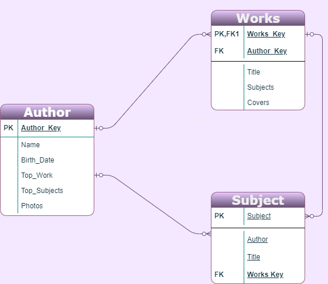

# Book-Friend-Proposal
This is the initial proposal for my second capstone project, currently named Book Friend.

1. The tech stack that I plan to use is React and Node, and to style my app with either ReactStrap or Tailwind CSS

2. I am going to attempt to make the focus of this app full-stack, but if I struggle too badly with it I will default back to a front-end focus.

3. This is going to be a website that will function on mobile devices if need be.

4. The goal of my project is to provide readers with a website where they can search for other works by their favorite authors and also have books suggested to them based on the subject that they search. I also want readers to be able to save their favorite books in a “To be read” tab.

5. The demographic I am trying to reach is that of avid readers.

6. The data I plan on using will be User data (data they input for their favorite authors/books} and data from [The Open Library API](https://openlibrary.org/developers/api). I plan on getting the User input data with a form.

7. A. My database schema will match that of the Open Library’s, author name, book name, publication date, etc.
B. I may run into issues with different spellings for authors/books, and have a hard time finding them all within the API
C. The only sensitive information I will need to secure is the User signup/login information.
D. The functionality my app will include will be the ability to search an author’s full work, the ability to search book details, the ability to search for similar books based on a subject, and the ability to save book information in a favorited section.
E. User flow will be something along the lines of signing up/logging in, having the books the user has favorited displayed on the homepage, user will be able search for authors/other books, user will be able to delete books from favorited, the user will be able to edit their user profile. Should I think of anything else, I will add to it.
F. My stretch goal is to be able to provide a shop feature where the user will be able to purchase the books they have searched for.

## Schema Design

